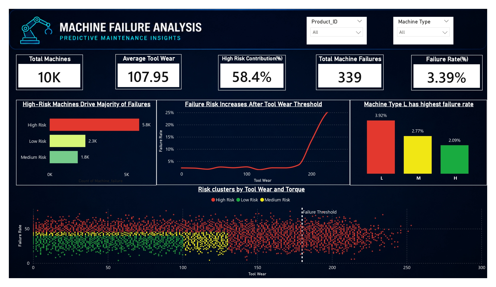
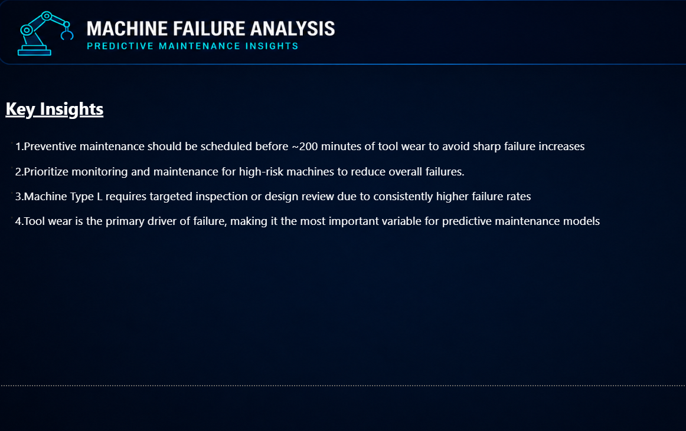

# 🚀 Machine Failure Analysis (Predictive Maintenance)

## 📌 Project Overview

This project analyzes machine failure patterns to support **predictive maintenance strategies**. Using SQL and Power BI, the analysis identifies key drivers of failure and risk clusters.

## 📊 Dashboard Highlights

### Failure Overview


### Key Insights



---

## 📊 Key Metrics

* **Total Machines:** 10,000
* **Total Failures:** 339
* **Failure Rate:** 3.39%
* **Average Tool Wear:** 107.95
* **High-Risk Contribution:** 58.4%


---

## 🔍 Key Insights

* Preventive maintenance should be scheduled **before ~200 tool wear**
* **High-risk machines contribute 58.4%** of total failures
* Machine Type **L has the highest failure rate (3.92%)**
* Tool wear is the **strongest predictor of failure**

---

## 📈 Dashboard Features

* Failure rate by machine type
* Tool wear vs failure trend
* Risk clustering (**High / Medium / Low**)
* Interactive filters (Product ID, Machine Type)

---

## 🛠️ Tools & Technologies

* **SQL** – Data extraction
* **Power BI** – Data visualization
* **Data Analysis** – Predictive insights

---

## 📂 Project Structure

```
Machine-Failure-Analysis/
│
├── Machine_Data.sql
├── Machine_Failure_Analysis.pbix
├── Main_Dashboard.jpg
├── Insights.jpg
└── README.md
```

---

## 🎯 Business Impact

* Reduces unexpected machine downtime
* Enables data-driven maintenance scheduling
* Identifies high-risk machines proactively

---

## 📎 How to Use

1. Open `.pbix` file in Power BI Desktop
2. Load SQL dataset if required
3. Explore dashboard filters and insights

---
